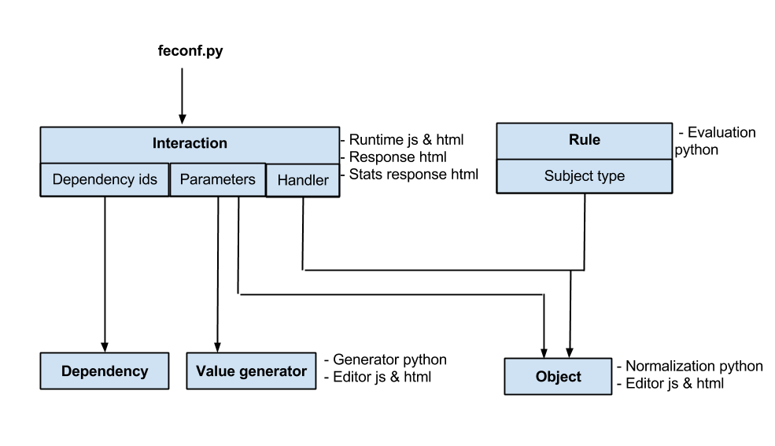

# Extensions overview

These pages explain how to create new interactions and associated code, and how to integrate them with Oppia.

Each state/card of an Oppia exploration contains an interaction which receives an answer from the reader and sends it to the Oppia backend. Based on this answer, Oppia then determines what to show next to the reader.

Currently, new interactions must be added by the owner of the Oppia application by making a change to the code. However, you are very welcome to submit interactions to the Oppia codebase for inclusion in the main Oppia release. If you'd like to do this, we'd encourage you to get in contact with us prior to writing the interaction, in order to ensure that it is a good fit and to minimize duplication of work.

**Important!** The following specifications for interactions and associated code are not yet set in stone, and are still evolving. We cannot guarantee backwards-compatibility yet, and will update this notice when that changes. However, we will update existing interactions in the core Oppia codebase if any changes are made to how interactions are defined.

### Documentation ###

Interactions and associated objects are related as follows:

  

The arrows indicate dependencies, so each interaction parameter must specify both a value generator and an object type, while the interaction handler must specify an object type (that will be sent to the backend when a reader submits an answer to the interaction). The rules available to the exploration creator will be all of those associated with the interaction handler's object type. Interactions must be enabled in `feconf.py`.
